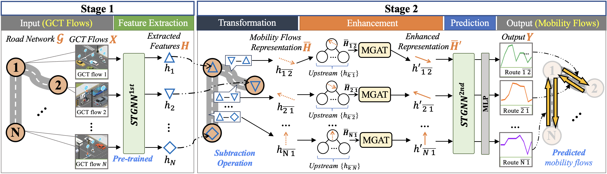

# 2-Stages STGNN Framework

This is a Pytorch implementation of the proposed 2-stage STGNN framework.




### using undirected GCT flows to forecast directional mobility flows.


## Data Preparation

- The original CSV file for GCT flow is available at: [GCT flow.csv](../Data/Raw/merged_GCT.csv)
- The original CSV file for Mobility flow is available at: [Mobility flow.csv](../Data/Raw/merged_mobility.csv)
- To generate the **train/val/test datasets** for each type of GCT flow as {train,val,test}.npz, please follow the [script](https://github.com/liyaguang/DCRNN/blob/master/scripts/generate_training_data.py),
using the CSV files provided above.

Here is an example:

### GCT flow
|        Date         | Road Segment 1 | ...  | Road Segment 34 | 
|:-------------------:|:--------------:|:--------------:|:--------------|
|         ...         |    ...         |    ...         |   
| 8/29 18:30 |  449        |  ...        |   244        |   
| 8/29 18:45 |  368        |  ...        |   225        |    
| 8/29 19:00 |  344        |  ...         |   247        |  
|         ...         |    ...         |    ...         |   

### Mobility flow
|        Date         |  1_to_2(edge 1) | ... | 34_to_32(edge 84) | 
|:-------------------:|:--------------:|:--------------:|:--------------:|
|         ...         |    ...         |    ...         |    ...         |    ...        |    ...        |    ...        |
| 8/29 18:30 |      24        |    ...        |   56        |
| 8/29 18:45 |        17         |     ...        |   51        |
| 8/29 19:00 |     38         |    ...        |   53        |
|         ...            |      ...        |   ...        |


#### How to Create

We split data in 7:2:1 for generating train/test/val data.

Run the [scripts](https://github.com/liyaguang/DCRNN/blob/master/scripts/generate_training_data.py) to generate the train/test/val dataset.

## Graph Construction
As the implementation is based on pre-calculated distances between road sections, we provided the CSV file with road section distances and IDs at: 
- GCT Flow: [Distance between connected road segments (in meters)](../Data/GCT_Flows/nodes_distance.txt). 
- The distance between Mobility Flows corresponds to the distance of their starting nodes, 
  based on: [GPS coordinates for each road segment ID](../Data/Mobility_Flows/neighbors_manual_v7_rename.csv).

Run the [script](https://github.com/liyaguang/DCRNN/blob/master/scripts/gen_adj_mx.py) to generate the Graph Structure based on the "Road Section Distance" file provided above.

The `processed Graph Structure of Road Section Network` is available at: 
- GCT Flow: [road network structure file](../Data/GCT_Flows/adj_mat_input.pkl)
- Mobility Flow: - [road network structure file](../Data/Mobility_Flows/adj_mat_input.pkl)


## Datasets for training
The **processed train/val/test data structures file** is available, 
- data structures file for GCT flow:
```
../Data/GCT_Flows
```

- data structures file for Mobility flow: 
```
../Data/Mobility_Flows
```

## Example of pre-trained Models

We provide an example of a pre-trained model:

- Example of a Pre-trained Model (trained for GCT flow prediction): 
  
  => We use MFGM ([https://arxiv.org/abs/2401.03138](https://arxiv.org/abs/2401.03138)) as an example. This model is pre-trained for feature extraction.

We provide parts of model weights in: 

```
./save
```

like: ```exp202308271352_0.pth``` ... ```exp202308271352_2.pth```

## Framework Training

The code for each part of the framework architecture is provided above.

Please set the location of the dataset and graph structure file in argparse.ArgumentParser() of parameters.py

And put all codes together to run the training process.

Or directly run the ```Jupyter Notebook``` for model training with ```Framework.ipynb```

Dataset for training should be put in:

```
../Data
```

Please put pre-trained model in:

```
./save
```

The weighting of trained Framework will generate in:

```
./save
```

