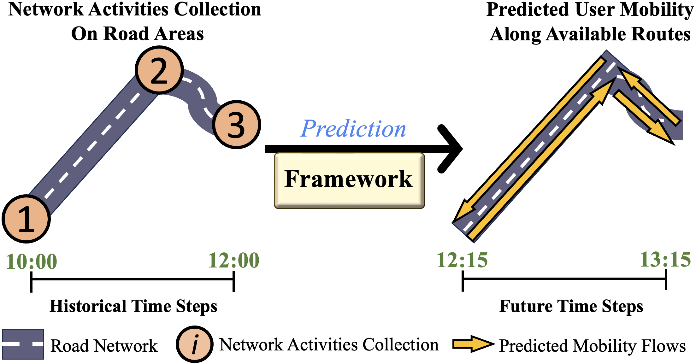
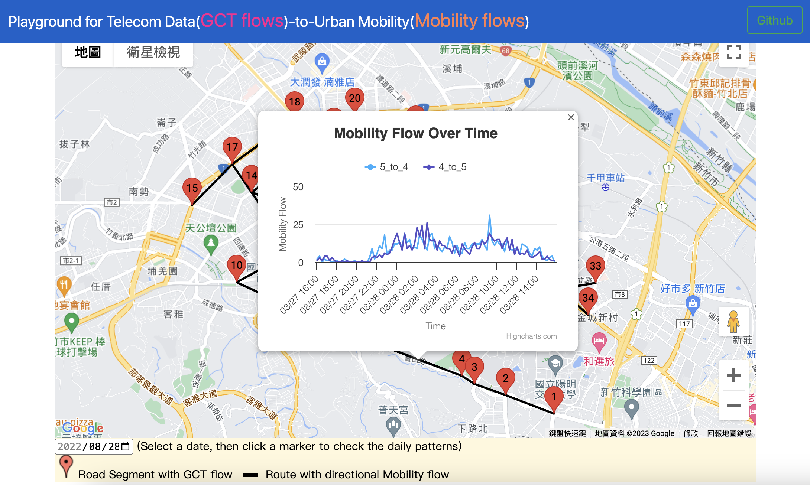
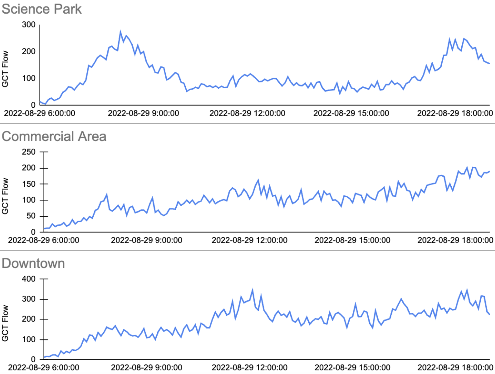
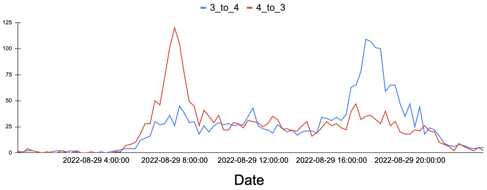
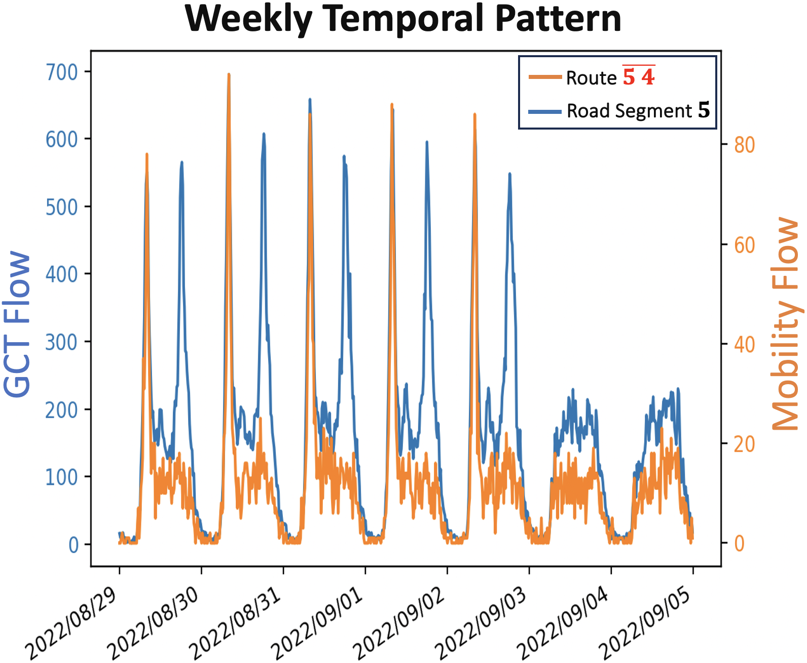
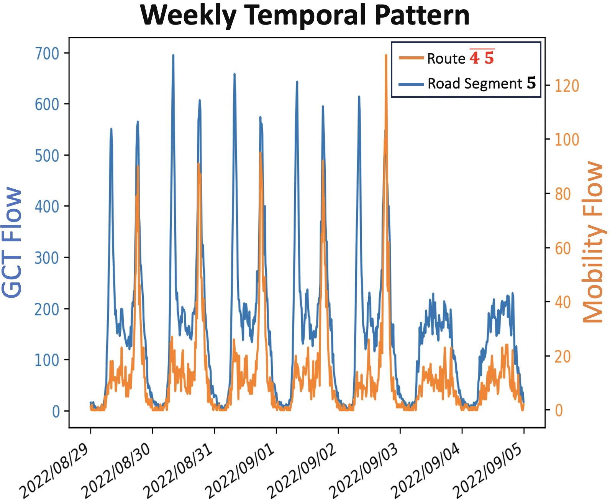
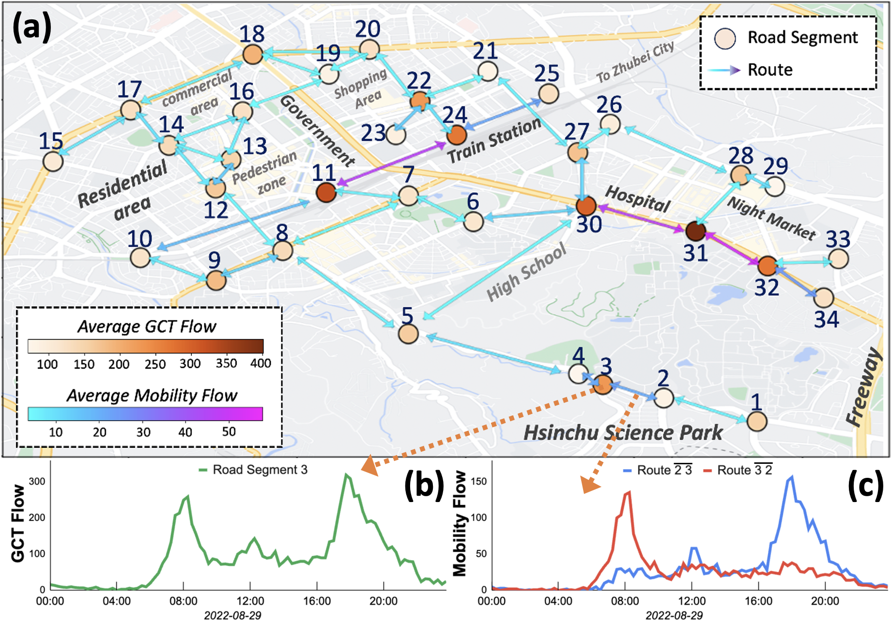

# TeltoMob
This is the official supplement for our research: Enhancing Sustainable Urban Mobility Prediction with Telecom Data: A Spatio-Temporal Framework Approach


## Task Overview 


*Using *Historical* undirected road segments' features (i.e., GCT flows), to predict *Future* directional routes' features (i.e., Mobility flows)*


## Demo Page

[https://cy07gn.github.io/TeltoMob-Demo/](https://cy07gn.github.io/TeltoMob-Demo/)




## Undirected GCT Flows and Directional Mobility Flows

### GCT 

GCT is cellular traffic with estimated GPS coordinates obtained from triangulation, indicating where the traffic was generated. 

Here are the partial examples of GCT records (*IMEI numbers were hashed to protect privacy):

|       Time     |    IMEI        |    Longitude   |      Time      |    
|:--------------:|:--------------:|:--------------:|:--------------:| 
|       ...      |    ...         |    ...         |    ...         |  
|     07:30:36   |    H...aK      |   24.78711     |   120.98641    |
|     07:31:02   |    B...EQ      |   24.78702     |   120.98664    |
|     07:31:07   |    M...Gn      |   24.78703     |   120.98642    |
|       ...      |    ...         |    ...         |    ...         | 

### GCT Flow
We define GCT flow as the total quantity of GCT within a fixed interval (e.g., 15 minutes) using public traffic flow datasets.

Below are partial examples of GCT flows from areas near different regional functionality:



---

### GCT Pairings

Refers to the association of consecutive GCT entries for a single user when they are found in adjacent road segments within a 15-minute timeframe.

Examples of GCT pairing from route segment IDs 3 to 4:
|     Start Time     |    End Time        |    Longitude   |  
|:--------------:|:--------------:|:--------------:| 
|       ...      |    ...         |    ...         |  
|     07:30:36   |    07:32:32      |    H...aK      |  
|     07:31:02   |    07:35:42      |    B...EQ      |  
|     07:31:07   |    07:33:17      |    M...Gn      |  
|       ...      |    ...         |    ...         |    

### Mobility Flow

The total count of GCT pairings for a road route, recorded at fixed time intervals (e.g., 15 minutes).

Here is the example from route segment 3 to 4 and route segment 4 to 3:


* It is obvious that the peak of each is in a different period, as route segment 4 to 3 represents the incoming route toward work, while route segment 3 to 4 represents the incoming route direction departing from work.* 

### The correlations of GCT flow and Mobility Flow

The GCT flow, which captures bidirectional user traffic, shows peaks during commuting periods. 
However, mobility flow manifests peaks primarily during specific commute times and depends on the route direction. 

For instance, route 5_to_4, which is significant during the morning commute to work, exhibits a pronounced peak, as shown below. 


In contrast, route 4_to_5, predominantly used during the evening commute from work, showcases its peak in the following Figure. 



### Road segment and Routes
The road segments are defined as 20m x 20m areas, which is based on the average road size in our proof-of-concept (POC) area in Hsinchu, Taiwan. 
All the GCTs listed in the above table are located within the predefined road segments, nearby various regional functionality.

The Hsinchu road network showcases 34 segments and 84 routes. Color intensity denotes the average GCT and mobility flows, respectively.

Routes with a high standard deviation in mobility flow are distinguished by a star mark.

Here are the distribution examples of selected road segments:



## Experimental Materials Providing 

### I. Graph Structure of Network with Road Segments and Routes

We provide instructions on how to construct a road network in the Hsinchu POC area:

Graph structure construction: To generate the graph structure based on the **..._Distance.txt** file provided below, please follow the [script](https://github.com/liyaguang/DCRNN/blob/master/scripts/gen_adj_mx.py). 

#### GCT Flow
- [GPS coordinates for each road segment ID](./Data/GCT-flow/nodes_manual_v7_rename.csv)
- [Distance between connected road segments (in meters)](./Data/GCT-flow/nodes_distance.txt)
- [road network structure file](./Data/GCT-flow/adj_mat_input.pkl)

#### Mobility Flow
- [total route ID](./Data/Incoming_Flows/edges_id.csv)
- [road network structure file](./Data/Mobility-Flow/adj_mat_input.pkl)


* The distance between each two routes (ex: i_to_j and k_to_w) is the distance among their starting route segments (ex: Dis(i,j)) *

### II. TeltoMob dataset used for training

TeltoMob dataset comprises GCT flow and Mobility flow. The Data Structure of TeltoMob is shown as follows:


|        Date         | Road Segment 1 | ...  | Road Segment 32 | Route 1 | ... | Route 84 | 
|:-------------------:|:--------------:|:--------------:|:--------------:|:--------------:|:--------------:|:--------------:|
|         ...         |    ...         |    ...         |    ...         |      ...        |   ...        |
| 08-29 18:30 |  262        |  ...        |   244        |    24         |    ...        |   56        |
| 08-29 18:45 |  218        |  ...        |   225        |    17         |     ...        |   51        |
| 08-29 19:00 |  188        |  ...         |  247        |    21         |    ...        |   53        |
|         ...         |    ...         |    ...         |    ...         |      ...        |   ...        |

- The original CSV file for GCT flow is available at: [GCT flow.csv](./Data/Raw/merged_GCT.csv)
- The original CSV file for Mobility flow is available at: [Mobility flow.csv](./Data/Raw/merged_mobility.csv)
- To generate the **train/val/test datasets** for each type of GCT flow as {train,val,test}.npz, please follow the [script](https://github.com/liyaguang/DCRNN/blob/master/scripts/generate_training_data.py),
using the CSV files provided above.


---

The dataset is provided at:
```
./Data
```

Experimental code is provided at:
```
./Model
```
